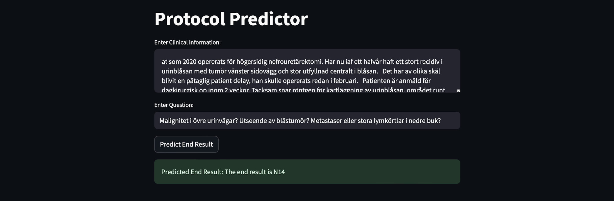

# 🧠 NLP-Assisted Computed Tomography (CT) Diagnosis 



This repository documents the core logic and AI integration behind a 6-week collaboration with a Swedish medical clinic and a Danish radiologist. The project involved deploying an AI tool tailored to **Computed Tomography (CT)** scan assistance, focusing on **abdominal and vascular diagnosis** using clinical textual input written in **Swedish**.

The AI tool interprets clinician-entered symptoms and contextual information to suggest the **optimal CT examination** required.

---

## 📌 Project Scope

- ✅ Deploy an AI assistant for CT scan triage (abdominal/vascular)
- ✅ Handle sensitive Swedish clinical data
- ✅ Fine-tune GPT-like models via prompt engineering
- ✅ Build and deploy the tool via a **WordPress frontend**
- ✅ Host the logic via **PythonAnywhere** backend

---

## 🛠️ Technologies Used

```yaml
frontend:
  - WordPress: used to embed and present the chatbot UI

backend:
  - PythonAnywhere: backend hosting platform for inference and API calls

ai_model:
  - OpenAI Davinci (GPT-3): used via prompt completion, optionally fine-tuned
  - Prompt engineering: multi-turn instruction formatting

languages:
  - Python 3.10
  - Swedish clinical input processed via English prompts

```
---

## 🚀 Key Features

- 🗣️ Accepts **Swedish clinical free-text input** describing symptoms or diagnostic intentions.
- 🧠 Uses **OpenAI’s Davinci model** with **prompt completion strategy** to output the appropriate CT scan procedure.
- 🔄 Supports **prompt engineering workflows** using few-shot examples embedded in the prompt itself.
- 🛠️ Offers **fine-tuning capability** (experimentally explored with `.jsonl` training data) for more consistent responses.
- 🌐 Deployed via **PythonAnywhere** and connected to a **WordPress frontend** for real-world usability.
- ✅ API accessible for integration with other platforms or workflows.

---

## 🔬 Prompt Engineering & Fine-Tuning Logic

The project includes an iterative prompt design workflow, built and tested inside a Jupyter Notebook:

### 🔄 Prompt Completion 

A baseline method using prompts like:

```python
prompt = f"Clinical Information: Patient presents with acute abdominal pain and prior history of vascular disease. \nCT Scan Recommendation:"
```

Called using:

```python
openai.Completion.create(
    engine="text-davinci-003",
    prompt=prompt,
    max_tokens=256,
    temperature=0.2
)
```
---

## 📈 Performance & Evaluation
- Achieved 96% accuracy in matched test cases (via manual clinician feedback).
- Prompt templates were validated across multiple symptom types (abdominal pain, vascular issues, etc.).
- Fine-tuned models showed reduced hallucinations and better format consistency.

---
## 📬 Contact

Youssef Benaouda, AI Freelancer 
✉️ benaoudayoussef123@gmail.com
Active on Linkedin
